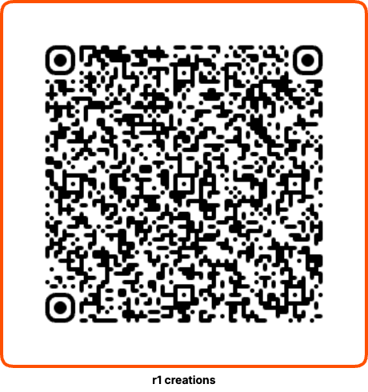

# Yeti Escape

Yeti Escape is a fast-paced pixel-art skiing game built for Rabbit r1.

Choose from four skiers with different speed, turning, and acceleration characteristics, then race downhill through obstacles and jumps or tackle a slalom course. Build your score, master each skier, and watch out for the Yeti.

## Play

Yeti Escape is hosted on GitHub Pages:

https://iain-mag.github.io/yeti-escape/

## Install on Rabbit r1

Scan the QR code below with your Rabbit r1 to install and launch Yeti Escape.



## Controls for Rabbit r1

- **Scroll wheel or swipe** — steer
- **Screen tap** — select

## Controls for Browser

- **Arrow keys** — steer / select
- **Space bar** — select

## Game Modes

### Downhill

Ski down the mountain while avoiding rocks, logs, snowmen, and other obstacles. Jump obstacles, build your score, and survive until the Yeti appears. Escape the Yeti to finish the run and gain a points bonus!

### Slalom

Race through the slalom course, passing as many gates as possible while maintaining your speed and control.

## Skiers

Choose from four skiers, each with different characteristics for:

- Speed
- Turning
- Acceleration


## Repository Structure

```text
.
├── assets/
│   ├── main-6YKvTy2V.js
│   └── main-BFIG5Exg.css
├── qr/
│   └── yeti-escape-r1-qr.png
├── .gitignore
├── icon.png
├── index.html
├── README.md
└── screenshot.jpg